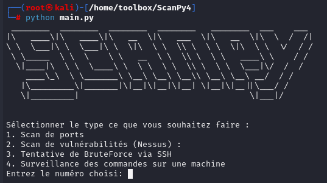

<h1 align="center">🛡️ ToolBox ScanPy</h1>
<p>
  
</p>

> ScanPy est une Toolbox pour identifier les failles de sécurité dans les réseaux informatiques. J'ai essayé de faire en sorte d'avoir une ToolBox plutôt complète afin d'avoir une certaine crédibilité professionnel.


## 📟 Fonctionnalité 
<B> - Découverte Réseau :</B> Permet de cartographier le réseau en identifiant les hôtes actifs et les services disponibles sur ces derniers.

<B> - Scan de port :</B> Permet d'analyser les ports ouverts sur une cible spécifique afin de déterminer les points d'accès potentiels.

<B> - Détection de vulnérabilités :</B> Identification des failles de sécurité pour anticiper et corriger les potentielles failles dans le système.

<B> - Tentative de connexion SSH :</B> Utilisation de la liste d’ID/mot de passe rockyou pour effectuer des attaques par force brute sur les connexions SSH.

<B> - Surveillance de commandes sur des machines distantes:</B> Permets d'avoir une visibilité sur toutes les commandes effectués sur des machines distantes afin de s'assurer qu'aucune activité malveillante est en cours

<B> - Génération de rapport :</B> Création de rapports détaillés sur les vulnérabilités détectées grâce à Nessus, un outil de gestion des vulnérabilités mais également la création de rapport .PDF pour chaques fonctionnalités

<br>


## 💻 Explication du projet 

<B> - main.py :</B> Point d'entrée qui lit la configuration, définit les arguments et lance les scans de ports, vulnérabilités ou attaques SSH.

<b> - scanpy.conf :</b> Fichier de configuration contenant les paramètres par défaut pour les scans de ports et de vulnérabilités. <br>
&nbsp;&nbsp;&nbsp;&nbsp;&nbsp;&nbsp;&nbsp;&nbsp;&nbsp;&nbsp;&nbsp;&nbsp;&nbsp;&nbsp;&nbsp;&nbsp;&nbsp;&nbsp;&nbsp;&nbsp;&nbsp;&nbsp;&nbsp;&nbsp;&nbsp;Ici les ID/MDP pour accèder à la console Nessus Web sont vierges. On peut donc choisir les identifiants à notre convenance 😊

<B> - scan.py :</B> Gère les interactions avec l'API Nessus pour initialiser, lancer, mettre en pause, reprendre, arrêter les scans et exporter les résultats.

<B> - ports.py :</B> Utilise nmap pour scanner les ports, récupère les informations sur les services et exporte les résultats en PDF.

<B> - nessus_api.py :</B>  Gère l'authentification et les interactions avec l'API Nessus, y compris la création, le lancement et l'exportation des résultats des scans via des requêtes web

<B> - parser.py :</B> Interface simplifiée autour de configparser pour lire les valeurs des paramètres du fichier de configuration.

<B> - ssh.py :</B> Effectue des attaques par force brute SSH en utilisant paramiko et la liste de mots de passe rockyou.txt.

<B> - requierement.py :</B> Liste des outils à installer au préalable pour faire marcher la ToolBox

<B> - template :</B> Template du rapport de scan pdf

<B> - .gitignore :</B> Fichier temporaire (on s'en fiche)

<B> - github/workflow :</B> Analyse statique et stylistique (avoir un code claire et lisible) des codes avec pylint, flake8, black, isort, et mypy.

<br>
<br>
<br>

<B>1. Initialisation et arguments :</B> main.py initialise le processus en fonction des arguments fournis.

<B>2. Configuration :</B> main.py lit les paramètres de scanpy.conf en utilisant parser.py.

<B>3. Scan de ports :</B> main.py utilise ports.py pour effectuer le scan et exporter les résultats.

<B>4. Scan de vulnérabilités :</B> main.py utilise scan.py pour interagir avec l'API Nessus via nessus_api.py.

<B>5. Bruteforce SSH :</B> main.py utilise ssh.py pour tenter les connexions avec paramiko.

<B>6. Gestion des résultats :</B> Les résultats sont sauvegardés et exportés en PDF dans le dossier <B>results</B>.

<br>


## ⚒️ Prérequis d'installation

Certains outils sont nécessaires pour mettre en place la ToolBox. Pour les installer, exécutez les commandes suivantes qui permettent de télécharger tout le nécessaire (requierements.txt) plus simplement  :

```sh
python -m pip install -r requirements.txt
sudo apt install wkhtmltopdf -y
```
<br>


## 📋 Comment ça marche ?

Une fois l'entité du projet installé, il faudra se rendre dans le répertoire en question. Une fois dedans :

```sh
python main.py
```
<br>
Maintenant, nous n'avons plus qu'à selectionner la fonctionnalité que nous souhaitons exécuter !
<br>

